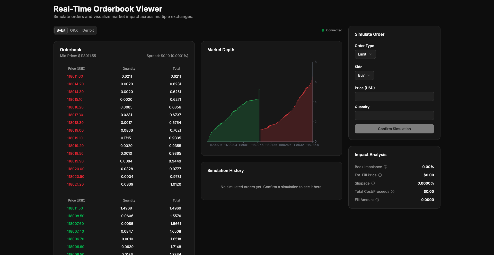
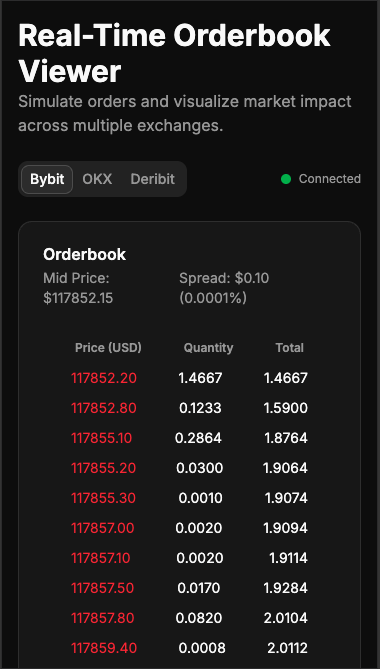
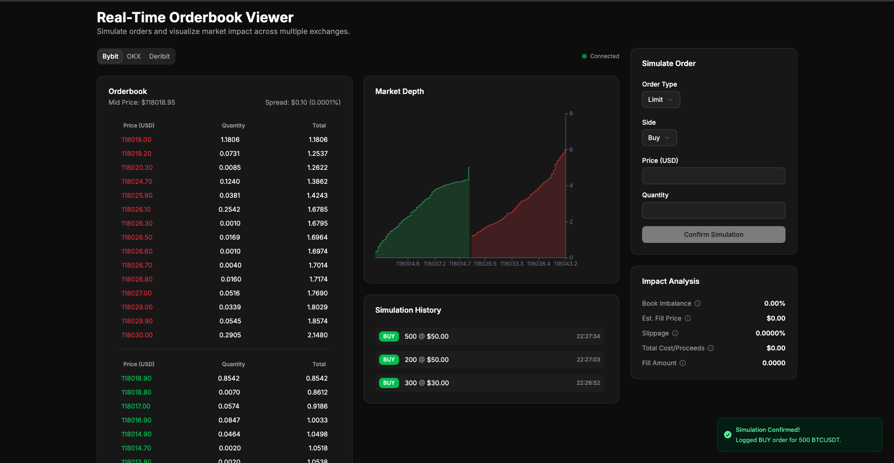

# 🚀 Real-Time Orderbook & Trading Simulator

This project is a high-performance, real-time orderbook viewer built with Next.js, submitted for the Frontend Developer assignment at GoQuant. It features multi-exchange WebSocket connectivity, an advanced order simulation system, and a suite of professional-grade UI/UX features.

**Live Demo:** **[goquant-odrebook-viewer.vercel.app](https://goquant-odrebook-viewer-8oco.vercel.app/)**

---

## 📸 Application Preview

| Desktop View                                         | Mobile View                                       | Simulation History                                     |
| :--------------------------------------------------- | :------------------------------------------------ | :----------------------------------------------------- |
|  |  |  |

---

## ✨ Features

This application meets all functional and technical requirements and includes several bonus features to enhance usability and provide deeper market insights.

| Core Requirements Implemented                                                                                              | 🏆 Bonus Features & Polish                                                                                                                                        |
| :------------------------------------------------------------------------------------------------------------------------- | :---------------------------------------------------------------------------------------------------------------------------------------------------------------- |
| **Multi-Venue Connectivity:** Real-time orderbook display from **Bybit**, **OKX**, and **Deribit**.                        | **📈 Market Depth Chart:** An interactive chart visualizing cumulative market depth.                                                                              |
| **Live Data Streaming:** Persistent **WebSocket** connections for minimal latency updates.                                 | **📊 Order Book Imbalance:** A real-time indicator showing the ratio of buy-side vs. sell-side liquidity.                                                         |
| **Advanced Order Simulation:** A comprehensive form to simulate **Market** and **Limit** orders.                           | **🌐 Live Connection Status & Reconnect:** A UI indicator shows the live WebSocket status (Connected, Disconnected) with a one-click reconnect option.            |
| **Dynamic Visualization:** Simulated orders are instantly highlighted in the live orderbook to show their position.        | **📋 Simulation History:** A log of all confirmed simulated orders, providing a record of user activity.                                                          |
| **Responsive Design:** The layout is fully optimized for both desktop and mobile use.                                      | **✨ Professional UI/UX:** Built with **shadcn/ui**, featuring **toast notifications** for user feedback and **skeleton loading states** for a smooth experience. |
| **Robust Form Handling:** Live validation, disabled submission button for invalid states, and auto-reset after submission. | **🛡️ Resilient Data Handling:** Defensively sanitizes and validates incoming API data to prevent UI errors and ensure stability.                                  |

---

## 🛠️ Tech Stack & Architecture

This project leverages a modern, scalable frontend stack chosen for performance and developer experience.

| Category               | Technology                        | Purpose                                                                                        |
| :--------------------- | :-------------------------------- | :--------------------------------------------------------------------------------------------- |
| **Framework**          | **Next.js 14** (App Router)       | For a robust, server-aware React application with optimized performance.                       |
| **Language**           | **TypeScript**                    | To ensure type safety and improve code quality and maintainability.                            |
| **State Management**   | **Zustand**                       | For simple, powerful, and scalable global state management without boilerplate.                |
| **UI & Styling**       | **Tailwind CSS** & **shadcn/ui**  | For a utility-first styling workflow and a set of beautifully designed, accessible components. |
| **Form Handling**      | **React Hook Form** & **Zod**     | For performant, robust form state management and schema-based validation.                      |
| **Data Visualization** | **Recharts**                      | For creating responsive and interactive charts.                                                |
| **Code Organization**  | **Custom Hooks** (`useOrderbook`) | To encapsulate and manage complex, reusable logic like WebSocket connections.                  |

---

## 🚀 Running Locally

To run this project on your local machine, follow these steps:

1.  **Clone the repository:**

    ```bash
    git clone https://github.com/vinaysolanki535/goquant-odrebook-viewer
    cd goquant-odrebook-viewer
    ```

2.  **Install dependencies:**

    ```bash
    npm install
    ```

3.  **Run the development server:**
    ```bash
    npm run dev
    ```

Open [http://localhost:3000](http://localhost:3000) with your browser to see the result.

---

## 📝 Architectural Decisions & Assumptions

- **Symbol Mapping:** A helper function (`getInstrumentName`) translates the common symbol `BTCUSDT` into the specific format required by each exchange (e.g., `BTC-USDT` for OKX, `BTC-PERPETUAL` for Deribit).
- **Market Orders:** A simulated market order is assumed to have no price limit and will fill at any available price. The price input is disabled for this order type to make this intent clear.
- **API Data Resilience:** The application defensively sanitizes and validates incoming WebSocket data to ensure UI stability, particularly for the Deribit snapshot which was observed to be unsorted.

## 📚 API Resources

- **OKX API:** [https://www.okx.com/docs-v5/](https://www.okx.com/docs-v5/)
- **Bybit API:** [https://bybit-exchange.github.io/docs/v5/intro](https://bybit-exchange.github.io/docs/v5/intro)
- **Deribit API:** [https://docs.deribit.com/](https://docs.deribit.com/)
